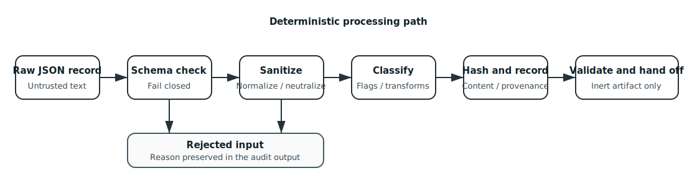

# Architecture

## System context

QSO-SEEKER sits between an external source adapter and bounded downstream consumers. It accepts local JSON records rather than making network requests itself. This preserves a clear authority boundary: a fetch adapter may read approved sources, while the sanitizer receives only bounded data and has no reason to possess source credentials.


## Component model

### CLI

`unicernal_search.cli` owns argument parsing, local JSON input and output, summary construction, and optional PDF rendering. The public console command is `unicernal-search`.

### Input schema

`unicernal_search.schema.RawSearchRecord` enforces strict objects, bounded repository and path fields, URL parsing, a maximum content size, supported source kinds, and traversal-resistant relative paths. Extra fields are rejected.

### Sanitization gateway

`unicernal_search.gateway.sanitize_records` processes records independently. It rejects executable and archive extensions, NUL-containing or binary-looking text, and schema-invalid records. Accepted text is normalized and neutralized before flags and SHA-256 content identities are produced.

### Canonicalization and contracts

`unicernal_search.contracts` defines canonical UTF-8 JSON, SHA-256 helpers, canonical-record v1 builders and validators, and attribution-sidecar validation. Contract validation is separate from basic sanitizer output so consumers can enforce a stable handoff contract rather than relying on implicit Python object shape.

### Evidence reporting

The CLI produces an audit entry for every input and can build JSON and PDF reports. Evidence includes counts, flags, content hashes, and a summary hash. Report generation does not convert source text into trusted instructions.

### Security verifier and CI

Repository tools inspect dependency declarations, package boundaries, hidden controls, tests, and workflow source identity. The consent-capacity policy is repository-wide and fail-closed. These checks are release evidence, not a substitute for architecture review or consumer-side validation.

## Data flow



1. An external adapter supplies a bounded local JSON file.
2. The CLI checks that the root value is an array of objects.
3. Each object passes strict schema validation or receives a rejection audit entry.
4. Extension and binary checks reject unsupported material.
5. Accepted content is normalized, active constructs are neutralized, and length is bounded.
6. Pattern classification records flags without executing or following source instructions.
7. The sanitizer emits accepted records and audit entries.
8. Optional report generation records deterministic summary material and a timestamped evidence event.
9. A handoff producer may build canonical-record and attribution-sidecar v1 artifacts.
10. Every consumer validates contract version, fields, hashes, paths, URLs, and canonical collections before use.

## Trust boundaries

| Boundary | Trusted for | Not trusted for |
|---|---|---|
| External adapter | Supplying bytes and declared source metadata | Truth, safety, execution, or policy compliance |
| Sanitizer process | Deterministic validation, transformation, rejection, and hashing | Network access, credentials, publication, or conclusions |
| Evidence artifact | Replaying a documented processing result | Automatic authority to execute or publish content |
| Contract validator | Detecting malformed or altered v1 artifacts | Deciding source truth or downstream permissions |
| Downstream consumer | Its own bounded use after validation | Bypassing QSO-SEEKER or treating text as commands |

## Failure behavior

QSO-SEEKER is designed to preserve partial evidence without silently accepting problematic input. One malformed record is rejected with an audit reason while other records may continue. Contract validators raise `ContractError` on unsupported versions, unexpected fields, invalid hashes, invalid paths or URLs, noncanonical collections, and content or identity mismatch.

## Deployment topology

The recommended topology uses two independently governed jobs:

```text
approved source reader
        |
        | bounded artifact + digest
        v
credential-free sanitizer
        |
        | accepted records + audit + evidence
        v
independent contract validator
        |
        v
bounded consumer
```

The repository currently documents this as the required target boundary. Claims of process, container, or microVM isolation require exact implementation and evidence before release documentation may mark them complete.

## Extension rules

New source kinds, fields, transformations, flags, hash inputs, or sidecar semantics must be introduced through an explicit contract revision with migration fixtures. New network, credential, repository-write, scheduling, consumer, or publisher authority belongs in separately reviewed components rather than being added implicitly to the sanitizer.
