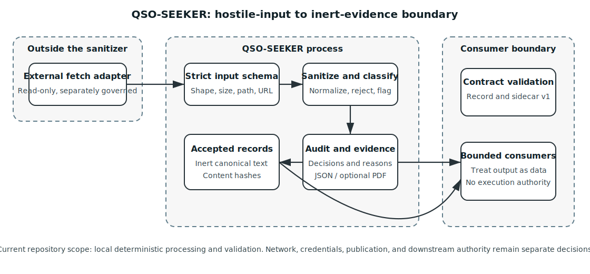

# QSO-SEEKER

QSO-SEEKER is the portfolio boundary for converting untrusted repository material into deterministic, inert records with explicit audit evidence. It is intentionally narrow: the repository validates bounded JSON input, rejects disallowed material, normalizes and neutralizes accepted text, records transformations and risk flags, and emits content-addressed artifacts for independent validation.



## What the repository provides

- A strict schema for externally supplied repository records.
- Fail-closed rejection of malformed, binary-looking, executable, archive, oversized, or unsafe-path input.
- Unicode normalization, control removal, active-content neutralization, bounded truncation, and pattern classification.
- Deterministic accepted-record and audit JSON outputs.
- Optional JSON and PDF evidence reports.
- Canonical-record and attribution-sidecar contract version 1, including independent hash validation.
- A least-authority design in which retrieval, sanitization, temporal interpretation, policy disposition, downstream consumption, and publication are separately governed.

## Current authority boundary

The accepted repository scope is local processing and contract validation. QSO-SEEKER does not itself authorize broad crawling, private-source access, credentials, content execution, repository mutation, scheduled collection, canonical-state acceptance, downstream QSO execution, or publication into a shared field.

A valid record hash proves local contract conformance. It does not independently establish that the observation is current, non-replayed, bound to the correct long-lived subject, legally publishable, accepted by Repository `1`, or safe for runtime use.

Proposed expansion work remains separate from the documented baseline until its own architecture, security, legal, privacy, provenance, compatibility, and rollback review succeeds.

## Portfolio gluing

The obstruction analysis documents the contracts that must exist around QSO-SEEKER:

```text
retrieval artifact
      ↓
QSO-SEEKER sanitizer and canonical producer
      ↓
temporal / subject / replay validation
      ↓
Bridge transport and Repository 1 disposition
      ↓
human review or bounded runtime consumer
```

Each arrow requires a versioned contract and fail-closed fixtures. Successful transport or display never creates authority by itself.

## Documentation map

| Guide | Purpose |
|---|---|
| [Project overview](project-overview.md) | Goals, non-goals, users, outputs, and repository relationships |
| [Architecture](architecture.md) | Components, data flow, boundaries, and failure behavior |
| [Design contracts](design-contracts.md) | Canonical record, attribution sidecar, hashing, and compatibility |
| [Obstruction and gluing](obstruction-and-gluing.md) | Cross-repository incompatibilities, ownership proposals, and pairwise/triple-overlap witnesses |
| [API and CLI](api-and-cli.md) | Command-line usage and supported Python surfaces |
| [Security model](security.md) | Threat model, controls, residual risk, and consumer obligations |
| [Developer onboarding](developer-guide.md) | Setup, tests, documentation workflow, and contribution rules |
| [Operations and recovery](operations.md) | Evidence handling, health checks, rollback, and incident response |
| [Repository governance](governance.md) | Task-chain alignment, release posture, and decision ownership |
| [Punch list](../punchlist.md) | P0-P6, documentation, release-evidence, and recovery work |

## First local run

```bash
python -m venv .venv
. .venv/bin/activate
python -m pip install --upgrade pip
python -m pip install -e .
unicernal-search sanitize input.json \
  --output build/accepted.json \
  --audit build/audit.json \
  --report build/report.json \
  --pdf build/report.pdf
```

The input must be a JSON array of objects containing `repository`, `path`, `url`, `content`, and an optional supported `source_kind`. Output remains untrusted data and must not be executed or treated as canonical truth.
