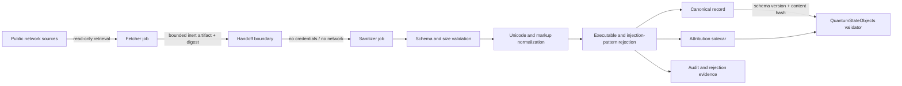

# QSO-SEEKER

QSO-SEEKER is the read-only retrieval and hostile-input boundary for bounded QSO experiments. It converts externally fetched material into inert canonical records and attribution sidecars while preserving transformations, rejections, provenance, and content hashes.

> **Current maturity:** pre-release security boundary. Existing logical separation between retrieval and sanitization must not be described as separate-process or microVM isolation until the workflow is split into separately permissioned jobs and the handoff digest is verified.

## Repository responsibilities

This repository owns:

- bounded input schemas for externally fetched text records;
- hostile-input validation and deterministic sanitization;
- canonical-record and attribution-sidecar contracts;
- explicit rejection reasons and transformation evidence;
- adversarial conformance fixtures;
- deployment guidance for credential and network separation.

It does not own:

- arbitrary repository execution, builds, imports, or package installation;
- credentials inside the sanitizer;
- QSO runtime construction (`QuantumStateObjects`);
- declarative genome definitions (`QSO-GENOMES`);
- any claim that sanitized text is trusted or safe to execute.

## Security pipeline

The current workflow may perform fetch and sanitization in one job. Until P2 is complete, the diagram is the target permission boundary rather than a claim about existing process isolation.

## Record classes

| Artifact | Purpose | Required properties |
|---|---|---|
| Fetch artifact | Inert transfer from network-enabled retrieval | bounded size, source URL/repository/path, retrieval time, raw-content digest, no executable handling |
| Canonical record | Deterministic sanitized text for consumers | schema version, transformations, rejection status, normalized content, content hash |
| Attribution sidecar | Source and licensing evidence | source identifiers, retrieval metadata, original and canonical hashes, attribution fields |
| Audit record | Explain every decision | accepted/rejected state, reason codes, transformation list, validator version, handoff digest |

## Security invariants

- Every external byte is untrusted data.
- No fetched content is imported, evaluated, shelled out to, compiled, installed, or executed.
- The sanitizer rejects executable types, binary-looking payloads, NUL bytes, oversize fields, malformed attribution, and prohibited control characters.
- Unicode normalization and concealment handling are deterministic and recorded.
- The credential-free sanitizer verifies the fetch artifact digest before parsing it.
- Consumers receive only canonical records and attribution sidecars, never raw archives, Git objects, package files, or credentials.
- Sanitization does not convert text into trusted instructions.
- Missing hashes, unsupported versions, ambiguous transformations, and malformed provenance fail closed.

## Delivery sequence

1. Reproduce the current tests, CLI output, security-envelope verifier, PDF report test, and workflow syntax checks.
2. Publish a versioned canonical-record plus attribution-sidecar schema and fixtures.
3. Split retrieval and sanitization into separately permissioned workflow jobs.
4. Add adversarial accepted/rejected fixtures with deterministic expected hashes.
5. Publish only evidence-backed deployment and isolation claims.

## Release gates

No release is ready until:

- repository-specific task acceptance criteria are complete;
- the full test and CLI baseline passes or failures have reproducible evidence;
- adversarial fixtures pass deterministically;
- secret, dependency, workflow-permission, and supply-chain checks pass;
- retrieval and sanitizer permissions match documented claims;
- schemas, transformations, limits, and reason codes are documented;
- provenance includes tool versions, commands, fixture hashes, artifacts, and rollback instructions.

## Documentation map

- [Security architecture and handoff contract](security-architecture.md)
- [Task chain](../taskchain.md)
- [Release plan](../release.md)
- [Changelog](../changelog.md)
- [Root overview](../README.md)
