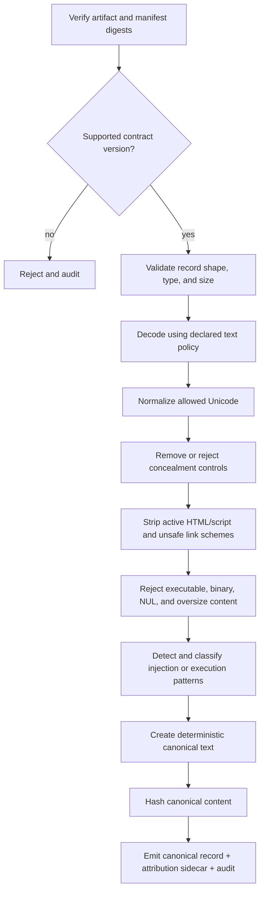

# Security Architecture

## Objective

QSO-SEEKER reduces the attack surface between public content and bounded QSO experiments. It does not decide whether a claim is true and does not make content executable. Its output is normalized, attributable, bounded, and still untrusted.

## Permission model

The target deployment uses two separately permissioned jobs or processes:

| Component | Network | Repository token | Other credentials | Input | Output |
|---|---:|---:|---:|---|---|
| Fetcher | Read-only allowlisted egress | Read-only only when required | None by default | source request | inert fetch artifact + digest |
| Sanitizer | None | None | None | verified fetch artifact | canonical record, attribution sidecar, audit evidence |

The sanitizer must be capable of running in an environment with no network route and no injected secrets. Separation is meaningful only when enforced by workflow permissions or process isolation; calling two functions in one privileged job is logical separation, not a security boundary.

## Handoff contract

The fetcher-to-sanitizer artifact should contain a closed list of records and a manifest equivalent to:

```json
{
  "contract": "qso.seeker-fetch-artifact",
  "contract_version": "1.0.0",
  "created_at": "<timestamp>",
  "records": [
    {
      "record_id": "<stable-id>",
      "repository": "owner/repository",
      "path": "README.md",
      "url": "https://example.invalid/source",
      "media_type": "text/markdown",
      "size_bytes": 1234,
      "sha256": "<raw-content-sha256>"
    }
  ],
  "artifact_sha256": "<manifest-and-payload-sha256>"
}
```

Final field names and paths must be defined by the P1 schema task. The example documents requirements; it does not expand current implementation scope.

## Sanitization stages



Every stage records whether it transformed, rejected, or passed the record. Transformations must be deterministic and ordered.

## Canonical-record minimums

A versioned canonical record should identify:

- contract and schema version;
- stable record identifier;
- source repository, path, and URL;
- media type and accepted character encoding;
- original digest and canonical digest;
- normalized inert text;
- ordered transformation codes;
- acceptance state and rejection reason codes;
- size before and after processing;
- sanitizer implementation version;
- attribution-sidecar reference.

Unknown or omitted required fields must not be filled by guesswork.

## Attribution sidecar minimums

Attribution should remain independently inspectable and include:

- source locator and retrieval timestamp;
- repository and revision identifiers when known;
- original and canonical hashes;
- author, license, and notice fields when supplied by the source;
- transformations that affect quotation or representation;
- evidence that the sidecar corresponds to the canonical record.

Missing licensing information should be represented as unknown, not inferred.

## Rejection taxonomy

Stable reason codes should cover at least:

- unsupported contract or schema version;
- digest mismatch;
- malformed record or attribution;
- path, URL, or media type outside policy;
- oversize field or aggregate artifact;
- NUL byte or binary content;
- executable or archive type;
- Unicode concealment or invalid encoding;
- active script/markup payload;
- unsafe command or link scheme;
- injection pattern above the configured threshold;
- non-deterministic or ambiguous transformation result.

Human-readable explanations may change; machine reason codes should remain versioned.

## Adversarial fixture matrix

| Fixture family | Required evidence |
|---|---|
| Bidirectional and zero-width concealment | deterministic reject or normalized output and exact transformation codes |
| Prompt-injection language | detection result without executing or following the text |
| Executable/archive types | rejection before content interpretation |
| Oversized records and collections | bounded rejection without memory exhaustion |
| Binary and NUL-bearing input | deterministic rejection |
| Malformed source and attribution metadata | fail-closed record with reason code |
| Markup and command-link schemes | stripped or rejected according to policy |
| Valid multilingual text | preserved meaning under the documented normalization policy |

## Consumer contract

`QuantumStateObjects` should validate canonical fixtures using local schemas and hashes. It must not import QSO-SEEKER code and must continue treating accepted content as untrusted observations. A successful sanitizer decision means only that the record conforms to the bounded transport policy.

## Verification and rollback

A release candidate must include exact test commands, workflow permissions, fixture hashes, artifact checksums, sanitizer version, dependency and secret scan results, and a proof that the sanitizer job receives no credentials. Roll back when isolation claims are inaccurate, accepted outputs become non-deterministic, a digest can be bypassed, or a severe adversarial fixture is mishandled. Failed-candidate evidence must be retained.
