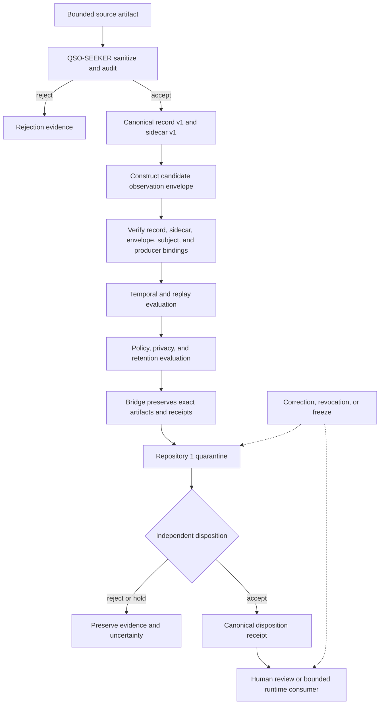

# Candidate source-observation envelope profile

## Status and purpose

This document defines a **documentation-only candidate profile** for carrying a locally valid QSO-SEEKER canonical record into the wider A.L.I.S.T.A.I.R.E. evidence system without changing canonical-record contract version 1.

The profile exists because a valid content hash is necessary but insufficient for portfolio use. It does not by itself establish stable subject identity, observation time, freshness, replay status, policy approval, privacy authorization, correction state, canonical-state acceptance, or runtime suitability.

No contract identifier, package owner, signing format, registry, or authority is accepted by this document. Those decisions remain portfolio governance work.

## Design rule

QSO-SEEKER keeps ownership of the exact source-facing artifact and its local canonical identity. Additional interpretation is attached by reference rather than written back into the canonical record.

```text
canonical record v1
    immutable source content and provenance identity

candidate observation envelope
    subject, time, replay, policy, privacy, completion, and lifecycle references

temporal and policy decisions
    independently produced receipts that do not rewrite either object
```

This separation prevents later policy or temporal conclusions from silently changing the identity of the sanitized source evidence.

## What remains unchanged

The existing accepted contracts remain authoritative for their current scope:

- `qso-seeker.canonical-record`, schema version `1`;
- `qso-seeker.attribution-sidecar`, schema version `1`;
- strict UTF-8 canonical JSON and deterministic SHA-256 identities;
- inert-data handling and fail-closed validation;
- local rejection and transformation evidence.

The candidate envelope must never redefine canonical-record fields, recalculate `record_id`, replace `sidecar_sha256`, or imply that a canonical record is current or approved merely because an envelope exists.

## Candidate responsibility split

| Concern | Candidate owner | Boundary |
|---|---|---|
| Source bytes, sanitizer result, canonical record, attribution sidecar | QSO-SEEKER | Exact local evidence and deterministic identity |
| Stable subject and source-lineage references | designated subject-identity owner | Does not rewrite source locators or record identity |
| Clock provenance, uncertainty, ordering, freshness, and replay interpretation | `datarepo-temporal-invariants` candidate | Produces independent temporal receipts |
| Domain interpretation and synthesis proposal | QSO-DIGITALIS candidate | Does not create canonical source or policy authority |
| Version-preserving packaging and transport | Bridge candidate | Preserves bytes, hashes, versions, and receipts |
| Quarantine, policy disposition, correction, revocation, and canonical state | Repository `1` candidate | Produces authority receipts; execution or transport success is not acceptance |
| Presentation | QSO-STUDIO and AionUi | Displays state and uncertainty without creating authority |
| Runtime consumption | QuantumStateObjects and QSO-FABRIC | Applies independent runtime policy; content remains inert evidence |

The word *candidate* is material. No route or owner is activated until governance accepts the corresponding contract and fixtures.

## Candidate envelope fields

The following logical fields define the minimum information required for review. Exact serialization, optionality, signatures, and schema identifiers remain unresolved.

### Envelope identity

- `envelope_contract_id` — provisional contract identity selected by the future neutral owner;
- `envelope_schema_version` — integer version with Boolean values rejected;
- `envelope_id` — deterministic identity over the accepted canonical envelope representation;
- `created_at` — envelope-construction time with clock provenance supplied separately or inline under an accepted temporal contract.

### Bound Seeker artifacts

- `record_contract_id` and `record_schema_version`;
- `record_id`;
- `sidecar_contract_id` and `sidecar_schema_version`;
- `sidecar_sha256`;
- `record_artifact_sha256` and `sidecar_artifact_sha256` over the exact transported bytes;
- `producer_repository`, `producer_commit`, `producer_job_id`, and `producer_adapter_id`.

A consumer must verify the exact artifacts and their local contracts before interpreting any envelope metadata.

### Source and subject references

- `source_locator` — evidentiary URL, repository/path, or other bounded source locator;
- `source_revision` — immutable revision or content locator where available;
- `source_lineage_ref` — mirror, fork, redirect, rename, replacement, or migration lineage;
- `subject_ref` — stable observed-subject identifier issued by the designated subject owner;
- `subject_binding_method` — versioned method used to bind the source evidence to the subject;
- `ownership_or_authorization_ref` where the observed subject is a device, private source, or controlled environment.

The source locator remains evidence. It is not itself a stable subject identity.

### Observation and temporal references

- `observed_at`;
- `clock_id` and `clock_evidence_ref`;
- `uncertainty` or bounded time interval;
- `freshness_policy_ref`;
- `valid_until` when the policy yields one;
- `replay_domain`;
- `replay_token`, sequence, nonce, or prior-observation reference under the accepted replay contract;
- `temporal_receipt_ref` and temporal status such as `current`, `stale`, `uncertain`, or `unverifiable`.

QSO-SEEKER may preserve collector-provided time fields, but it must not claim trusted ordering or freshness without the temporal owner’s receipt.

### Collection completion and limitations

- `collection_status` — `complete`, `partial`, `failed`, `unsupported`, or `unknown`;
- `completed_checks` and `incomplete_checks` using namespaced identifiers;
- `rejection_refs` for locally rejected inputs;
- `limitations` as bounded machine-readable codes plus human-readable explanation;
- `expected_artifacts` and verified artifact hashes;
- `toolchain_ref` and dependency or environment evidence where required.

A partial observation cannot be promoted to complete simply because every emitted artifact is internally valid.

### Policy, privacy, and retention

- `source_policy_ref`;
- `purpose_ref`;
- `privacy_class`;
- `access_class`;
- `retention_policy_ref` and `retention_until` when applicable;
- `redaction_profile_ref`;
- `license_or_terms_ref`;
- `policy_decision_receipt_ref`.

Missing or expired policy evidence must fail closed for live collection, private-source processing, retention, transport, or publication.

### Lifecycle references

- `supersedes_envelope_id` when this observation replaces an earlier envelope;
- `correction_refs`;
- `revocation_refs`;
- `freeze_ref`;
- `recovery_checkpoint_ref`;
- `downstream_invalidation_receipt_refs`;
- `canonical_disposition_receipt_ref`.

Corrections and revocations are additive evidence. They do not erase the original record or envelope.

## Candidate state machine



No state transition is inferred merely from the existence of a later artifact. Each transition requires an explicit receipt and compatible contract version.

## Fail-closed consumer algorithm

A consumer of a source-observation envelope must:

1. reject malformed, duplicate-key, unknown-version, or noncanonical envelope input;
2. verify the exact canonical-record and sidecar bytes and local contract identities;
3. verify that the envelope binds the expected record, sidecar, producer, adapter, and immutable commit;
4. validate subject identity and authorization under the designated subject contract;
5. validate clock provenance, uncertainty, freshness, ordering, and replay state;
6. validate policy, privacy, source terms, retention, and access class;
7. check correction, revocation, freeze, and supersession state;
8. preserve `partial`, `unsupported`, and `unknown` completion states;
9. require a separate Repository `1` disposition before treating the observation as canonical;
10. apply the consumer’s own runtime or presentation policy without executing source content.

Failure at any step yields a namespaced reason code and no automatic truth, policy, runtime, or publication promotion.

## Reason-code domains

The future reason-code registry should preserve domains rather than collapse all failures into a generic invalid state:

- `seeker.schema.*`;
- `seeker.sanitization.*`;
- `seeker.provenance.*`;
- `subject.identity.*`;
- `temporal.clock.*`;
- `temporal.freshness.*`;
- `temporal.replay.*`;
- `policy.source.*`;
- `policy.privacy.*`;
- `policy.retention.*`;
- `bridge.transport.*`;
- `authority.disposition.*`;
- `lifecycle.correction.*`;
- `lifecycle.revocation.*`;
- `lifecycle.freeze.*`;
- `consumer.runtime.*`;
- `consumer.presentation.*`.

Namespace ownership and compatibility remain architectural decisions.

## Required pairwise fixtures

### Seeker record ↔ observation envelope

- correct record and sidecar binding;
- wrong record ID;
- changed artifact bytes with unchanged declared hash;
- wrong producer repository or commit;
- unsupported local contract version;
- incomplete or missing sidecar;
- partial collection represented honestly.

### Observation envelope ↔ temporal validator

- current observation;
- stale observation;
- uncertain clock;
- unsupported clock source;
- replayed envelope;
- duplicate observation with the same subject and content;
- out-of-order but valid observation;
- wrong-subject binding.

### Observation envelope ↔ Bridge

- exact byte preservation;
- duplicate delivery;
- truncation;
- receipt reordering;
- unsupported envelope version;
- missing policy reference;
- privacy-class downgrade attempt.

### Observation envelope ↔ Repository `1`

- accepted quarantine admission;
- rejected identity or policy;
- stale or replayed proposal;
- correction and revocation;
- expected-state mismatch;
- partial-failure preservation;
- freeze and bounded recovery.

## Required triple-overlap witnesses

### QSO-SEEKER → temporal invariants → Repository `1`

The canonical record and envelope identities remain unchanged while temporal interpretation and authoritative disposition are produced as separate receipts. A stale or replayed record cannot become canonical through a valid local hash.

### QSO-SEEKER → Bridge → QSO-STUDIO/AionUi

Transport and display preserve record identity, envelope identity, completion status, uncertainty, privacy-safe status, correction, revocation, and canonical disposition. A visible card or successful delivery is not an approval receipt.

### QSO-SEEKER → QSO-DIGITALIS → QuantumStateObjects

Domain interpretation remains a proposal linked to the source evidence. The runtime applies its own accepted policy and cannot convert source content, a Digitalis interpretation, or confidence metadata into executable authority.

### Incident authority → Repository `1` → all downstream consumers

Freeze, correction, or revocation propagates through Bridge, interfaces, caches, and runtime consumers without deleting original evidence. Recovery requires an explicit checkpoint, bounded restart order, and no automatic unlock.

## Privacy and publication boundary

Public documentation and fixtures must use synthetic or safely licensed representative data. They must not expose private source locators, credentials, session identifiers, stable private-device identifiers, raw rejected fragments, reviewer identities, or sensitive operational metadata.

An envelope suitable for internal processing is not automatically suitable for public publication. A publication profile must define field minimization, redaction, aggregation, legal basis, retention, correction visibility, and revocation propagation separately.

## Migration and rollback

Introducing an accepted envelope must not require rewriting canonical-record v1 artifacts. Migration should:

1. preserve existing record and sidecar bytes and hashes;
2. construct envelopes only when required binding evidence exists;
3. label unverifiable historical observations honestly;
4. retain the previous profile version and migration tool identity;
5. provide deterministic before/after fixtures;
6. permit consumers to disable the new profile and return to the last accepted contract set;
7. preserve correction, rejection, and failed-migration evidence.

## Acceptance gates

The candidate profile remains non-operational until:

- a neutral contract and registry owner is approved;
- canonical serialization and signing or attestation rules are selected;
- stable subject identity and source-lineage methods are approved;
- temporal, freshness, replay, and ordering ownership is accepted;
- policy, privacy, retention, and reason-code owners are accepted;
- Seeker, Bridge, Repository `1`, interfaces, and at least one runtime consumer implement identical fixtures;
- wrong-subject, stale, replay, correction, revocation, privacy, partial-collection, freeze, and recovery tests pass against immutable commits;
- one evidence manifest binds every contract version, fixture, workflow, artifact, and approval;
- rollback and end-to-end revocation propagation are exercised.

## Scope boundary

This profile changes documentation only. It does not modify canonical-record v1, add a schema package, activate retrieval, issue credentials, access private sources, enable network transport, create canonical state, authorize runtime ingestion, publish evidence, or grant any component new authority.
