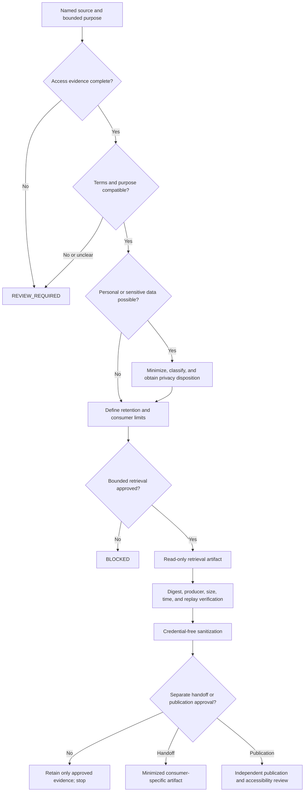

# Source rights and privacy review

## Status and purpose

Status: `DOCUMENTED_NOT_AUTHORIZED`

This guide defines a review method for deciding whether a source artifact may be retrieved, sanitized, retained, shared with another bounded component, or considered for a separately approved publication profile. It is documentation only. It does not grant collection authority, interpret a source's terms as legal permission, approve processing of personal data, authorize credentials, or activate a network, storage, publication, or deletion route.

QSO-SEEKER must remain fail closed whenever the source class, permitted purpose, subject expectations, retention rule, or downstream audience is unresolved. Public visibility is not the same as permission to collect, retain, correlate, republish, or use for a new purpose.

## Review axes

Every review evaluates the following axes independently. A favorable answer on one axis cannot substitute for another.

| Axis | Required question | Examples of evidence | Fail-closed result |
|---|---|---|---|
| Access | May the proposed reader lawfully and technically access the source? | public endpoint, approved account scope, source owner permission | no retrieval |
| Purpose | Is the requested use specific, necessary, and compatible with the approved project purpose? | task record, policy receipt, research protocol | no processing |
| Terms and license | Do source terms or a license permit the proposed copying, transformation, retention, and sharing? | license text, terms snapshot, written permission | legal/source-rights review required |
| Privacy | Could the artifact identify, link, infer, or expose a person or protected context? | data inventory, field review, linkability analysis | minimize, restrict, or reject |
| Sensitivity | Does the source contain credentials, private communications, precise location, health, legal, financial, minor-related, or other consequential information? | classification record, reviewer disposition | quarantine or reject |
| Retention | What is the shortest justified retention period, and who owns deletion, correction, and legal-hold decisions? | retention schedule, deletion receipt, legal-hold record | no durable retention |
| Transformation | Which transformations are necessary, reversible where required, and accurately disclosed? | sanitizer policy, transformation log, before/after hashes | no downstream promotion |
| Sharing | Which exact consumers may receive which minimized fields for which purpose? | access-class mapping, consumer contract, transfer receipt | no handoff |
| Publication | Is a separate minimized public artifact approved, reviewed, and provenance-bound? | publication decision, redaction review, exact artifact hash | no publication |

## Decision states

A source review uses one of these states:

- `REVIEW_REQUIRED` — evidence is incomplete or ambiguous; no retrieval or processing is authorized.
- `BOUNDED_RETRIEVAL_APPROVED` — a named source reader may retrieve the specified source class for the specified purpose and validity window.
- `SANITIZATION_ONLY` — the bounded artifact may enter the credential-free sanitizer, but it may not be retained, correlated, handed off, or published beyond the approved evidence package.
- `RESTRICTED_PROCESSING` — processing is limited by field, subject, purpose, consumer, location, or retention rule.
- `PUBLICATION_REVIEW_REQUIRED` — internal evidence may exist, but no public artifact is approved.
- `BLOCKED` — the source, purpose, terms, privacy risk, authority, or evidence is unacceptable.
- `WITHDRAWN` — prior permission or policy approval has been withdrawn; new processing stops and downstream correction duties begin.
- `EXPIRED` — a time-bounded decision is no longer valid.
- `SUPERSEDED` — a later review replaces the earlier decision while preserving its provenance.

These are review-document states, not implemented QSO-SEEKER schema values. A future machine-readable contract requires separate ownership, versioning, canonical bytes, validation, migration, and rollback approval.

## Decision flow

**Prose equivalent:** identify one source and one bounded purpose; verify access evidence and source terms; classify privacy and sensitivity; minimize fields; define retention and permitted consumers; obtain a time-bounded decision; retrieve through a separately permissioned reader; verify the artifact before parsing; sanitize without credentials or network access; and stop unless an independent handoff or publication review approves an exact minimized artifact.

## Source-class review matrix

The matrix below provides starting dispositions, not automatic approvals.

| Source class | Starting disposition | Required review before retrieval | Additional restrictions |
|---|---|---|---|
| Clearly licensed public documentation | `REVIEW_REQUIRED` | verify canonical license/version, permitted purpose, attribution, and retention | preserve source and license provenance |
| Government open-data portal | `REVIEW_REQUIRED` | verify current terms, dataset notes, update cadence, privacy exclusions, and official identifiers | do not infer that every field is suitable for republication or linkage |
| Public website without an explicit reusable-data license | `REVIEW_REQUIRED` | review terms, robots guidance where relevant, burden, purpose, and downstream use | public visibility alone is insufficient |
| User-supplied artifact | `REVIEW_REQUIRED` | confirm the user's authority to provide it and the requested purpose | do not assume rights over third-party or sensitive content |
| Authenticated or private source | `BLOCKED` by default | explicit credential, account, legal, privacy, security, and retention authorization | credentials remain outside QSO-SEEKER and its evidence artifacts |
| Private communications or account exports | `BLOCKED` by default | subject authority, third-party privacy, purpose, minimization, and deletion review | no publication; restrict linkage and reviewer exposure |
| Leaked, bypassed, or access-controlled material | `BLOCKED` | independent legal and security disposition | do not retrieve, mirror, sanitize, or redistribute merely because a locator exists |
| Personal, health, financial, legal, precise-location, or minor-related data | `BLOCKED` or `RESTRICTED_PROCESSING` | privacy-impact review, necessity, proportionality, subject risk, retention, access, and correction | use the least identifying representation; avoid enrichment and cross-context linkage |
| Source under correction, retraction, deletion request, or legal hold | `REVIEW_REQUIRED` | determine preservation, correction, access, and deletion obligations | preserve contested history without presenting superseded content as current |

## Minimum review record

A review record should identify:

- a unique review identifier and status;
- exact source class, locator policy, and canonical terms or license snapshot;
- bounded purpose, requester, reviewer role, and decision owner;
- access method and whether credentials, sessions, or private locators exist;
- personal-data, sensitivity, linkability, and vulnerable-subject assessment;
- approved fields, transformations, consumers, environments, and prohibited uses;
- collection, processing, retention, expiry, correction, withdrawal, deletion, and legal-hold rules;
- exact policy, privacy, security, attribution, and publication references;
- source, decision, artifact, and evidence hashes where applicable;
- decision time, validity window, supersession link, and rollback procedure;
- unresolved uncertainty and the condition that keeps the route closed.

The review record must not contain credentials, private source fragments, unnecessary personal data, stable private-device identifiers, or secret operational details.

## Data minimization and separation

Keep the following artifact classes separate:

1. **Source-reader evidence** — source class, policy reference, retrieval time, status, and artifact digest; no credentials.
2. **Raw retrieval artifact** — access-restricted, time-bounded, and never published by default.
3. **Sanitizer input** — bounded artifact plus expected producer, digest, size, validity window, and replay state.
4. **Accepted and rejected sanitizer evidence** — minimized records and reason codes; rejection output must not reproduce unsafe or sensitive source material unnecessarily.
5. **Observation envelope** — separately governed references for subject, time, policy, privacy, completion, correction, revocation, and recovery.
6. **Consumer-specific handoff** — only the fields and evidence required by the named consumer contract.
7. **Publication candidate** — a separately minimized artifact with independent legal, privacy, provenance, security, accessibility, and human approval.

No internal observation envelope, raw artifact, rejection report, or review record should become a public artifact merely because it can be rendered by GitHub Pages or transported by Bridge.

## Correction, withdrawal, deletion, and legal hold

A source decision is not permanent.

- **Correction:** link the corrected source and affected derivative artifacts; do not silently overwrite historical evidence.
- **Withdrawal:** stop new retrieval and processing, mark prior approval withdrawn, and notify authorized downstream custodians.
- **Expiry:** fail closed until a new decision is issued.
- **Deletion:** delete only under the designated retention and deletion authority; record a minimized deletion receipt when allowed.
- **Legal hold:** suspend deletion for the exact held scope while restricting use and access; a hold is not permission for broader processing or publication.
- **Revocation propagation:** invalidate caches, handoffs, review views, and publication candidates where the applicable contracts require it.
- **Recovery:** restore only the last accepted configuration and evidence state, then replay validation before bounded work resumes.

## Reviewer onboarding checklist

Before recording a disposition, a reviewer should:

1. confirm the exact source, proposed purpose, and requested output;
2. inspect the current terms, license, policy, and source-version evidence;
3. classify personal data, sensitivity, linkability, and subject risk;
4. remove fields and transformations that are not necessary;
5. define access classes, named consumers, expiry, retention, correction, and rollback;
6. verify that credentials and private locators cannot enter repository or workflow evidence;
7. distinguish retrieval permission from sanitization, handoff, interpretation, canonical disposition, and publication permission;
8. record uncertainty and choose `REVIEW_REQUIRED` or `BLOCKED` when evidence is incomplete;
9. bind the decision to immutable evidence and an explicit human owner;
10. ensure an accessible prose explanation accompanies any diagram, table, or machine-readable record.

## Accessibility and comprehension

Review interfaces must expose state, uncertainty, expiry, restrictions, and stop conditions in text rather than color alone. Tables require descriptive headings; diagrams require prose equivalents; links must describe their destination; reason codes require plain-language explanations; and keyboard, zoom/reflow, screen-reader, and cognitive-access review must be performed on the exact rendered artifact before any public publication claim.

## FYSA-120 capability map

This documentation applies the following capability nodes:

- `011-B` and `011-E` — accessible diagram design, prose equivalence, and cross-modal consistency;
- `012-A`, `012-B`, `012-C`, `012-D`, and `012-E` — information architecture, requirements, onboarding procedure, documentation validation, and lifecycle synchronization;
- `017-A`, `017-C`, and `017-E` — canonical source identification, decision and artifact provenance, hashing, preservation, and correction propagation;
- `018-B` and `018-E` — records classification, retention scheduling, responsibility mapping, privacy-aware retention, and contested-history preservation;
- `019-B`, `019-C`, and `019-D` — plain language, accessible review states, uncertainty, and risk communication;
- `033-A` and `033-E` — data minimization, purpose limitation, linkability analysis, retention control, privacy-impact review, and consent provenance.

Proposed non-authoritative subdivision: **`018-F — Source-rights, privacy, and publication-disposition records`**. It would cover terms and license snapshots, bounded-purpose decisions, personal-data and linkability classification, time-bounded permissions, correction/withdrawal/deletion/legal-hold state, consumer-specific disclosure, and public-artifact approval without merging those responsibilities into retrieval or sanitization authority.

## Approval and rollback boundary

This guide may support documentation review immediately. Any machine-readable review schema, live source registry, authenticated adapter, durable store, automated deletion process, policy engine, consumer route, publication workflow, or external enforcement requires a separate proposal, threat model, contract owner, tests, migration plan, rollback evidence, and explicit human authorization.
